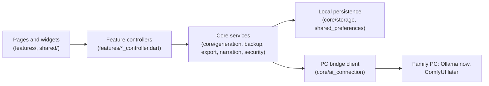

# Codebase map

This document explains every source file in the repository, which feature it
belongs to, and the architecture rules that keep the app maintainable. Update
it whenever a file is added, moved, or changes responsibility.

## Architecture

The dependency direction is one-way. Widgets never touch storage, crypto, or
generation directly; they go through a feature controller, which uses a core
service, which uses local storage.

Rules that every change must respect:

- Widgets read state through Riverpod providers and call controller commands;
  they never construct services or repositories.
- Each feature has its own controller. `AppController` only loads and commits
  already-validated snapshots; it does not grow feature logic.
- Core services are Flutter-framework-light and platform-boundary focused so
  they stay unit-testable without a device.
- Stored JSON is validated on read (`AppState.validated`); corrupt local data
  surfaces as a typed error instead of being silently overwritten.
- User-reachable "that no longer exists" states throw `Exception` subtypes such
  as `UnknownEntityException` so screens can recover; only genuine programming
  bugs stay `Error`s.
- Expensive Argon2id work goes through `compute` with a top-level entry point,
  and the services keep an injectable deriver so tests can skip the isolate.
- Everything is free and local: no accounts, no analytics, no paid or required
  cloud service. The only network client talks to the family's own PC bridge
  on the home network, and only when the parent selected Local AI.
- All authored public APIs carry `///` documentation (`public_member_api_docs`
  is enforced by the analyzer).

## Entry point and app frame — `lib/app/`, `lib/main.dart`

| File | Responsibility |
| --- | --- |
| `lib/main.dart` | Boots the Flutter binding and runs the root widget inside a Riverpod `ProviderScope`. |
| `lib/app/iam_hero_app.dart` | Root `MaterialApp.router` widget; binds the persisted locale and active-profile theme to the routed application, and asks for the one automatic library synchronization that follows an app start. |
| `lib/app/app_controller.dart` | Loads the complete persisted `AppState` on startup and commits snapshots that feature controllers have already persisted. Also the composition root: hosts the repository and service providers and the `storyGeneratorProvider`, which follows the parent's saved generator mode and falls back to the demo only while those settings are still loading. |
| `lib/app/app_router.dart` | go_router configuration: all routes, the shell wrapper, and parent-PIN gating for parent-only destinations (`/settings`, `/kingdom`, `/profiles`, `/review`, `/generation`). |
| `lib/app/app_shell.dart` | Responsive navigation frame around every route: app bar plus drawer and bottom navigation on mobile, extended rail on desktop widths (≥ 900 px). |
| `lib/app/app_theme.dart` | The shared visual system: the named redesign palette tokens (`night`, `tile`, `sunken`, `candle`, `candleLight`, `onCandle`, `light`, `frost`, `muted`, `mutedDeep`, `hairline`, `hairlineWarm`) every component theme reads from — cards, fields, chips, buttons, app bar, dialogs, and the bottom bar, rail, and drawer; the per-child color schemes (rose for girls, cyan for boys, plus saved custom colors) that stay the accent on rings, indicators, and selected states; the Outfit interface typography, whose `wght` axis is pinned per style because the bundled variable file defaults to its thinnest instance; and the reader's bedtime prose, surface, and warm page wash. `interfaceFontFamilyFor` is the one place the Arabic fallback is decided, following `AppLanguage.usesLatinScript` exactly as story prose does. |

## Domain models — `lib/core/models/`

| File | Responsibility |
| --- | --- |
| `app_language.dart` | The four supported languages (English, Arabic, Swedish, Somali) with ISO codes, used for both interface chrome and story text. |
| `app_state.dart` | The complete persisted application snapshot: `schemaVersion`, locale, profiles, active profile, and stories. `AppState.validated` enforces uniqueness, referential integrity (every story belongs to an existing profile), and newest-first story order. Writes version 4 (reading comfort and reading rewards; 3 added kingdom personalization, 2 added birth dates), reads versions 1 through 4, and refuses anything newer with `UnsupportedSchemaVersionException`. `requireSupportedAppStateSchemaVersion` is shared with the single-story share payload. |
| `child_profile.dart` | One child's private profile: name, optional `birthDate` plus the legacy stored age it replaced, required Girl/Boy choice, optional base64 reference photo (≤ 2 MB), saved theme color, story preferences, the `KingdomTheme` decoration, `ChildReadingSettings`, and the identities of stories finished on this device. `ageOn`/`age` compute a birthday-accurate age and fall back to the legacy value. Every `with…` transformation goes through one private copy helper so a newly stored field cannot be dropped. Includes the validated editor form model. |
| `child_reading_settings.dart` | Per-child reading comfort: the four `ReaderTextSize` steps (scaling the theme body size) and the easy-reading font switch, which resolves to the bundled Latin-script family and stays absent for Arabic. Deliberately separate from `child_story_preferences.dart`, which is prompt context copied into every generated story. |
| `reading_badge.dart` | The 1, 5, 10, and 25 finished-story badges plus the pure helpers for badges earned, the badge reached exactly now, and the next one. Counts only: no streaks, dates, or daily goals. |
| `shared_story.dart` | Payload of one encrypted single-story file: snapshot `schemaVersion`, the complete `StoryBook`, and the hero's display name for the import preview. Carries no photo and no other profile field. Also owns `DuplicateStoryException`, raised when an imported story identity already exists locally. |
| `kingdom_theme.dart` | One child's My Kingdom decoration: castle style, avatar frame, backdrop flavor, and favourite symbol. Every choice is optional and enum-name encoded; an absent field decodes to its default and an unknown stored name is refused with a `FormatException`. |
| `unknown_entity_exception.dart` | `UnknownEntityException`, the recoverable error thrown when a command targets a profile, story, or queued job that no longer exists locally. |
| `child_story_preferences.dart` | Per-child story defaults chosen by the parent: favorite topics, recurring story world, default story language, and `SafetyTopic` exclusions destined for future local AI prompts. |
| `generation_job.dart` | One durable story-generation request with lifecycle states (`queued`, `running`, `failed`, `cancelled`). Jobs survive app restarts so requests are never silently lost. |
| `story_models.dart` | Everything a story is made of: `StoryLength` (6/8/10 pages), `IllustrationStyle`, `StoryReviewStatus` (draft/approved), `StoryHero`, `StoryPrompt` (with legacy-JSON migration), `StoryPresentation`, `StoryRequest`, `StoryPage` (prose plus a `sceneDescription` reserved for ComfyUI), `StoryContent`, and the persisted `StoryBook` with favorites and collection labels. `withProfileId` re-attaches a whole book to another local profile, which is how an imported story file joins a chosen child's shelf. |

## Core services — `lib/core/`

### Generation — `core/generation/`

| File | Responsibility |
| --- | --- |
| `story_generator.dart` | The `StoryGenerator` boundary: `generate(StoryRequest) → StoryBook`, implemented by the demo generator and by the local AI adapter (see `docs/LOCAL_AI_INTEGRATION.md`). Also `CancellableStoryGenerator`, the optional extension for generators whose work runs on another machine and must be stopped there. |
| `demo_story_generator.dart` | Clearly labeled offline sample generator. Produces deterministic, gender-aware prose in all four languages, weaves in the child's saved preferences and recurring world, and must never be presented as AI output. |
| `local_ai_story_generator.dart` | The local AI adapter: submits one request to the paired PC bridge, polls the job every two seconds until it is terminal, and maps the completed payload onto `StoryBook` after checking language, page count, and page order. Every failure — unreachable, unauthenticated, failed job, cancelled, unusable payload, timeout — throws a typed `BridgeException`; it never returns demo content and never yields a partial book. Implements `CancellableStoryGenerator` so cancelling in the app also stops the PC. |

### Local AI connection — `core/ai_connection/`

| File | Responsibility |
| --- | --- |
| `bridge_client.dart` | Typed HTTP client for the PC bridge over `package:http`, so the same code runs on mobile and web: bearer token attached, bodies sent as explicit UTF-8 with `charset=utf-8` (Arabic corrupts otherwise), one bounded timeout per call, and every transport or bridge failure converted into a typed reason. Covers health, pairing, generation, the three synchronization calls, and delete-everywhere. Also owns the default address and `parseBridgeBaseUrl`, which refuses anything that is not a plain `http`/`https` origin. |
| `bridge_exception.dart` | `BridgeFailure` and `BridgeException`: the typed reason a bridge call failed, deliberately carrying no bridge-authored prose so every parent-facing sentence is localized in the app. |
| `bridge_models.dart` | Validated payloads of the bridge contract: health statuses, job submission, job status, the completed story and its pages (including the optional owning profile and timestamps a synchronization download adds), the exact generate-request field names, and the shared bridge-timestamp parser. |
| `bridge_sync_models.dart` | Validated payloads of the synchronization contract: the metadata-only manifest with its profile, story, illustration, and deletion entries, one downloaded story, and the delete-everywhere answer. Absent lists decode as empty and both spellings of the deletion list are accepted, so one added field cannot fail a whole sync. |
| `library_sync_state.dart` | What this device already took from the master library: the last reported watermark, the bridge `updatedAtUtc` of every downloaded story, and the "not wanted offline" list that keeps sync from re-downloading a story the parent removed here. Stories themselves stay in `AppState`, which is what makes them readable offline. |
| `library_sync.dart` | One synchronization: read the manifest, download only the stories that are new or whose timestamp moved, then report the manifest back — and only then hand the caller a library to persist, so a failure at any step changes nothing locally. Downloaded stories arrive approved with their pages' `BridgeStoryProvenance` rebuilt; a story generated on this device is adopted without a transfer so a pending review is never overridden; a story whose child has no local profile is reported instead of being placed on an invented profile. `mergeSyncedLibrary` applies the outcome to the library as it is at persistence time. |
| `ai_connection_settings.dart` | `StoryGeneratorMode` (demo or local AI) and the persisted `AiConnectionSettings` (mode plus bridge address). Holds no secret. |
| `bridge_credential.dart` | The stored pairing record — token, device name, pairing time — plus the device-name and pairing-code validators. Stored like the parent-PIN verifier under its own key, never logged, and `toString` never reveals the token. |
| `bridge_story_provenance.dart` | Builds and reads back the bridge story and illustration identities carried inside `StoryPage.sceneDescription`, following the demo generator's em-dash segment convention, so no stored story needs migrating when ComfyUI lands. `storyIdOf` is how every surface recognizes one master-library story, including a story generated here whose local identity came from its queued job. |
| `local_ai_progress.dart` | `LocalAiStage` and `LocalAiProgress`: what the PC is doing right now, as an enum rather than the bridge's English progress sentence. |

### Storage — `core/storage/`

| File | Responsibility |
| --- | --- |
| `local_repository.dart` | The only code that touches `shared_preferences`. Persists locale, profiles, stories, the generation queue, the stored schema version, the AI connection settings, the bridge pairing token, and the library synchronization record; validates on load; `replaceState` swaps the whole snapshot during a backup restore while preserving the device's parent PIN and its pairing, and rolls every replaced key back if any write fails midway. Deleting all family data clears the sync record too, so a rebuilt library can be synced back. |

### Backup — `core/backup/`

| File | Responsibility |
| --- | --- |
| `encrypted_backup_codec.dart` | The shared `EncryptedEnvelopeCodec` — Argon2id key derivation (19 MiB, t=2, p=1) on a background isolate plus AES-256-GCM, with the envelope's format name and authenticated associated data supplied per payload type — and `EncryptedBackupCodec`, which uses it for portable `.iamhero` family snapshots. Typed exceptions distinguish wrong password, malformed or foreign file, oversized input (64 MiB cap), and a snapshot from a newer app version. |
| `story_share_codec.dart` | Encrypts and validates one `.iamhero-story` file on the same envelope with a distinct format name and associated data, so a story file and a full backup can never be opened as each other even under the same password. |
| `backup_file_service.dart` | Platform file flow for backups: save and pick encrypted files on Android, iOS, and web through `file_picker`. |
| `story_share_file_service.dart` | Platform file flow for single-story files: pick and save `.iamhero-story` on Android, iOS, and web, reusing the backup size cap and read error, with a bounded safe file name derived from the story title. |

### PDF export — `core/export/`

| File | Responsibility |
| --- | --- |
| `story_pdf_service.dart` | Renders one approved story as an A4 **picture book** entirely on-device: a cover carrying the story's first illustration and its title in a display face, a dedication page ("this book belongs to…", the child's kingdom badge, the moral, the creation date), one sheet per story page with the picture over roughly the top two thirds and the prose in a soft rounded panel beneath a page-number badge, and a back cover with the moral and the app mark. The book's own words are printed in the **story's** language, loaded through `AppLocalizations.delegate`, not in the parent's interface language. Places the child's photo on the cover only when the parent asked for it at export time, and never on inner pages. Pages with no picture get a title-led text layout instead of a hole. Loads fonts sequentially because concurrent `rootBundle.load` calls resolve empty under the test binding, and loads only the one display face the story's script needs. |
| `story_pdf_layout.dart` | `StoryPdfLayout` — reading direction and every measurement that depends on it (badge corner, accent-bar side, mirrored panel padding), resolved eagerly so Arabic mirroring is assertable in a test rather than only visible in the file — and `StoryPdfPalette`, the wash/panel/accent/ink colours each `IllustrationStyle` prints in. |
| `story_pdf_symbols.dart` | `paintKingdomSymbol`: each of the twelve favourite kingdom symbols drawn as PDF vector shapes for the dedication page. Deliberately not an icon font, so the export depends on nothing outside this app's own asset bundle. |
| `pdf_file_service.dart` | Opens the platform save dialog for a rendered PDF and produces a safe, bounded file name from the story title. |

### Narration — `core/narration/`

| File | Responsibility |
| --- | --- |
| `narration_service.dart` | Device text-to-speech boundary (`supports`, `speak`, `stop`) so the reader never depends on a TTS plugin directly. Deliberately thin: one utterance at a time, with completion the only progress signal required from a platform. |
| `device_narration_service.dart` | The real implementation using voices already installed on the device; free and offline. |
| `narration_options.dart` | Validated narration settings: speech speed presets, narration scope (current page or rest of story), the off/5/10/20-minute `NarrationSleepTimer`, and the `NarrationRequest` value passed across the boundary. |
| `sentence_splitter.dart` | Pure sentence splitter shared by narration and the reader highlight. Splits on `.` `!` `?` `؟` `…` and line breaks, keeps a run of terminators with its sentence, drops blank fragments, and reports each sentence's offsets inside the original page text so the highlight never rewrites the story. |

### Parent security — `core/security/`

| File | Responsibility |
| --- | --- |
| `parent_security.dart` | The stored PIN verifier record (version, salt, Argon2id verifier — never the PIN) plus its failed-attempt counter and cooldown, the escalating throttling policy (5 free attempts, then 30 s / 1 m / 2 m / 5 m cap), the in-memory parent access state, and the typed attempt result. Version-1 records still decode as having no attempt history. |
| `parent_security_service.dart` | Hashes and verifies the optional 4–8 digit parent PIN with Argon2id and a constant-time comparison, deriving on a background isolate through an injectable deriver. |

## Features — `lib/features/`

### Home — `features/home/`

| File | Responsibility |
| --- | --- |
| `home_page.dart` | Personalized dashboard: profile setup prompt for new families, primary create-story action, and the most recent approved books. |

### Profiles — `features/profile/`

| File | Responsibility |
| --- | --- |
| `profile_controller.dart` | Commands for child identity: add/edit/delete profiles, active-profile switching, gender, theme color, story preferences, the kingdom decoration, reading comfort, and the reading-reward history (`recordFinishedStory` returns the badge just earned; `forgetFinishedStory` drops a deleted story from every child). Resolves the saved birth date and rejects any resulting age outside 1–17, while letting a legacy age-only profile keep its stored age. New profiles seed their default story language from the current locale. |
| `profile_page.dart` | Profile list and the editor form (name, localized birth-date picker bounded to ages 1–17, Girl/Boy choice, reference photo). |

### My Kingdom — `features/kingdom/`

| File | Responsibility |
| --- | --- |
| `my_kingdom_page.dart` | Family hub for switching the active hero and personalizing each child's app color palette, plus the active child's castle header, framed avatar, favourite symbol, and page backdrop. |
| `kingdom_style_card.dart` | Parent-editable castle, photo frame, backdrop, and favourite-symbol choices for the active child. Each selection persists immediately through `ProfileController` and confirms with a snackbar. |
| `kingdom_decorations.dart` | Every kingdom decoration drawn locally: `KingdomCastle` and the framed `KingdomAvatar` (`CustomPaint`), the backdrop gradient, and the bounded Material icon for each favourite symbol. Adds no binary asset and makes no network call. |
| `story_preferences_card.dart` | Parent-editable per-child story preferences: favorite topics, recurring world, default language, and safety-topic exclusions, with a four-language chip dialog. Also hosts the reading-comfort controls (text size and easy-reading font), which save immediately and state that Arabic prose keeps its usual letters. |
| `reading_rewards_card.dart` | The active child's finished-story count, all four badges drawn with Material icons, and progress toward the next badge. Read-only and count-based; no streaks or dates are shown because none are stored. |

### Story creation — `features/story_creation/`

| File | Responsibility |
| --- | --- |
| `story_creation_page.dart` | Guided request form: hero selection, Girl/Boy confirmation, theme, moral, language, length, and illustration style, with a persistent notice naming the generator this request will actually use and a progress panel that follows the paired PC stage by stage. |
| `story_controller.dart` | Owns the generation transaction: validates the request, enqueues a durable job, waits for the saved generator selection so a Local AI family is never quietly handed the demo, runs the generator, and persists the finished draft atomically — a failed generation writes no story. Cancelling the request that is currently running also stops it on the PC. Deleted profiles and stories surface as `UnknownEntityException`. |
| `generation_queue_controller.dart` | Persists the generation queue independently of app state so interrupted or failed requests survive restarts and can be retried or cancelled. Commands for a job that no longer exists raise `UnknownEntityException`. |
| `generation_center_page.dart` | Parent-only generation center: honest report of the selected generator and its readiness, the localized stage of a job running on the PC, and retry/cancel controls. Cancel stays enabled while a job runs, because it is the parent's only way to stop a story the PC already started. |
| `generation_progress_controller.dart` | Holds the current `LocalAiProgress` above the generator boundary so the creation screen and the generation center can show a localized stage. Null whenever nothing is running, and always null for the demo generator. |

### Parent review — `features/review/`

| File | Responsibility |
| --- | --- |
| `story_review_page.dart` | Parent-only draft queue and full-text review surface. Every generated story starts as a draft, invisible to the child, until the parent approves or deletes it. The page preview uses the hero's saved reading comfort so the parent reads what the child will read. Approval opens the reader. |

### Library — `features/library/`

| File | Responsibility |
| --- | --- |
| `story_library_page.dart` | The bookshelf: per-child tabs carrying each child's favourite symbol when multiple profiles exist, favorites and collection filters, a parent-only badge when drafts await review, the import-story-file action, and story deletion and sharing behind the parent gate. |
| `story_collections_dialog.dart` | Editor for a story's collection labels (for example bedtime, learning, adventures) with bounded, deduplicated parsing. |
| `story_share_controller.dart` | Commands for single-story files: encrypt one stored story with its hero name, save or pick the file, decrypt a selected file, and import it into a chosen profile. Refuses an already present story identity (`DuplicateStoryException`) and a destination profile that no longer exists (`UnknownEntityException`). |
| `story_share_actions.dart` | The parent-gated export and import flows: password prompt, decrypted preview (title, page count, hero), destination-profile choice, and one localized message per typed failure. Talks only to `StoryShareController`. |
| `story_delete_actions.dart` | The parent-gated deletion flow. A demo story keeps today's single local deletion; a story that also lives in the PC master library offers the two clearly worded choices instead — remove this device's offline copy, or delete it everywhere. Delete-everywhere requires the PC and reports the typed bridge failure without removing anything locally. |

### Reader — `features/reader/`

| File | Responsibility |
| --- | --- |
| `story_reader_page.dart` | Full-screen reader: swipeable pages, placeholder illustrations until ComfyUI, narration play/pause/stop with the spoken sentence tinted in place, speed, scope and sleep-timer settings, Arabic RTL story layout, the child's saved text size and easy-reading font, the session-only bedtime toggle, and PDF export behind a small dialog asking whether the cover carries the child's photo. Reaching the last page records the story as finished once per session and celebrates a newly earned badge. The control bar moves page progress above a wrapping action row below 560 px so a 360 px phone keeps full touch targets. Only approved stories can be opened. |
| `narration_controller.dart` | Owns the reader's sentence queue, position, playback state, and sleep timer above the `NarrationService` boundary: speaks one sentence per utterance, pauses by remembering the sentence and resuming from its start, follows rest-of-story narration onto the next page, and stops when the reader turns to a page the queue did not ask for. The clock and countdown are injectable so all of it is testable without a device. |
| `story_export_controller.dart` | Coordinates PDF rendering and the save dialog; refuses to export unapproved drafts and resolves the hero's photo only when the parent opted in. |

### Settings — `features/settings/`

| File | Responsibility |
| --- | --- |
| `settings_page.dart` | Language selection, AI connection, backup, parent PIN, and the deliberate delete-all-family-data action. |
| `ai_connection_controller.dart` | Owns generator-mode and bridge-address persistence, the health probe, the pairing ceremony, and forgetting a paired device. Holds the token inside its state exactly as `ParentAccessState` holds the PIN verifier. Also hosts the injectable HTTP client provider every bridge call travels through. |
| `ai_connection_card.dart` | The parent-gated AI connection card: Demo/Local AI selector, validated bridge address, a connection test showing the three localized statuses, the pairing modal that asks for the 6-digit code shown on the PC, and the synchronization section. The token is never rendered. |
| `library_sync_controller.dart` | Owns synchronization and both deletion kinds as transactions: "Sync now", the one automatic sync after an app start on a paired Local AI device, removing one offline copy (which also records it as not wanted), deleting one story everywhere through the PC, and clearing that not-wanted list. Nothing is published before it is persisted, and a removed story also leaves every child's reading-reward history. |
| `library_sync_section.dart` | The card's synchronization block: the sync action, when this device last agreed with the PC, the short `x new · y updated · z removed` report, the children whose stories are waiting for a local profile, the typed failure of the last attempt, and the re-download control for stories removed from this device. |
| `settings_controller.dart` | Locale persistence and the delete-everything transaction. |
| `backup_controller.dart` | Orchestrates export (state → encrypt → save file) and restore (pick file → decrypt → preview counts → replace state → refresh queue). |
| `backup_settings_card.dart` | Backup UI: password dialogs with confirmation, restore preview, and distinct localized error messages per failure type, including a backup written by a newer app version. |
| `parent_access_controller.dart` | Owns PIN persistence, the throttled attempt policy, the injectable clock, and the session unlock/lock state used by gates. A `WidgetsBindingObserver` re-locks the session when the app is paused or hidden. |
| `parent_security_settings_card.dart` | PIN status, setup, two-step Change PIN (current PIN then the new one twice), re-lock, removal controls, and the note that a forgotten PIN has no recovery. |

## Shared widgets — `lib/shared/`

| File | Responsibility |
| --- | --- |
| `app_state_boundary.dart` | Standard loading/error boundary every page uses around persisted state. |
| `parent_access_gate.dart` | Two parent-PIN surfaces: a full-page gate for parent-only routes and a modal prompt for destructive actions (deletion, export, collection edits). Refuses input while a cooldown is stored and shows the remaining wait; PIN fields never retain the secret. Also owns the shared localization of one attempt outcome. |
| `gender_selector.dart` | The required Girl/Boy selector shared by profile and story forms. |
| `app_language_dropdown.dart` | Four-language dropdown with ISO badges, shared by app settings and story settings. |
| `screen_layout.dart` | Width-constrained page scaffold, the hero panel — a flat tile ringed by the active child's accent rather than a gradient surface — and section headings. Accepts an optional per-page backdrop gradient, used by My Kingdom for the active child's chosen flavor. |
| `story_card.dart` | Library card with cover treatment, demo badge, and the favorite, collections, share, and delete commands its surrounding feature allows. The open action owns a full-width row and the icons wrap below it, so a one-column shelf on a 360 px phone keeps full touch targets. |
| `encryption_password_dialog.dart` | The password prompt shared by encrypted backups and single-story files, with per-file localized wording, optional confirmation field, the shared minimum length, and controllers that discard the secret with the modal. |
| `reading_text_style.dart` | Resolves story prose typography from one child's reading comfort by scaling the theme body size and requesting the easy-reading family only for Latin script. Shared by the reader and the review preview. |
| `reading_badge_view.dart` | The bounded Material icon and localized name of one reading badge, shared by My Kingdom and the reader's congratulation message. |
| `local_ai_messages.dart` | One localized sentence per typed bridge failure and per generation stage, shared by the creation screen, the generation center, and the AI connection card. The bridge's own English text is never shown. |

## Localization — `lib/l10n/`

| File | Responsibility |
| --- | --- |
| `app_en.arb`, `app_ar.arb`, `app_sv.arb`, `app_so.arb` | The four source translation files. Every user-visible string lives here; add new strings to all four. |
| `app_localizations*.dart` | Generated by `flutter gen-l10n` — never edit by hand. |
| `somali_platform_localizations.dart` | Hand-written Material/Cupertino localization delegate for Somali, which Flutter does not ship. |

## Assets — `assets/`

| Path | Responsibility |
| --- | --- |
| `assets/fonts/NotoSans-Regular.ttf` | Latin-script **body** font embedded only for offline PDF export (English, Swedish, Somali). |
| `assets/fonts/Outfit-Variable.ttf` | The **interface** typeface: headings, labels, buttons, chips, and navigation on every platform. One variable file (`wght` 100–900) whose default instance is the thinnest weight, so the theme pins the axis. Latin script only. |
| `assets/fonts/NotoNaskhArabic-Regular.ttf` | Arabic-script **body** font for offline PDF export, and the **interface** face for the Arabic locale, which Outfit cannot render. Regular weight only. |
| `assets/fonts/Baloo2-Variable.ttf` | Rounded storybook **display** face for exported titles, dedications and badges in English, Swedish and Somali. |
| `assets/fonts/Amiri-Bold.ttf` | Arabic **display** face for the same headings. Two faces rather than one because the PDF renderer shapes Arabic into Presentation Forms-B code points, which the rounded Arabic candidates do not carry — see `assets/fonts/README.md`. |
| `assets/fonts/AtkinsonHyperlegible-Regular.ttf` | Latin-script easy-reading font used only by the optional per-child reader setting; regular weight only. |
| `assets/fonts/OFL.txt`, `OFL-Outfit.txt`, `OFL-AtkinsonHyperlegible.txt`, `OFL-Baloo2.txt`, `OFL-Amiri.txt`, `README.md` | SIL Open Font License texts and provenance notes for the bundled fonts, including where each file came from, the measured glyph-coverage reasoning behind the display pair, and why the interface falls back to Naskh for Arabic. |

## Tests — `test/`

| File | What it proves |
| --- | --- |
| `test/app/iam_hero_app_test.dart` | End-to-end widget flows: onboarding, profile creation, choosing a birth date for a legacy age-only profile, story creation through review and approval into the reader, per-child library tabs, theme restoration, and localization. |
| `test/app/app_theme_test.dart` | The shared skin: every palette token holds its redesign value and reaches the cards, fields, chips, buttons, dialogs, and all three navigation surfaces; the active child's colour stays the accent on the filled button, the selected chip, and the indicators; every interface text slot asks for Outfit with its weight pinned on the axis; the Arabic locale asks for the Naskh face and never for Outfit; both faces are in the asset bundle; and the hero panel paints a flat tile with an accent ring instead of a gradient. |
| `test/core/generation/demo_story_generator_test.dart` | Demo stories respect language, page count, gender context, and saved child preferences; requests without a gender choice are rejected. |
| `test/core/models/child_profile_test.dart` | Legacy age-only profiles still decode, ages count the birthday itself (including leap-day children), and malformed, future, or too-recent birth dates are refused at the storage boundary. |
| `test/core/storage/local_repository_test.dart` | Real persistence round-trips, legacy-JSON migration, corrupt-data surfacing, `replaceState` preserving the parent PIN while clearing the queue, an end-to-end encrypted restore, rollback when a preference write fails midway, and refusal of a newer-schema backup. |
| `test/core/backup/encrypted_backup_codec_test.dart` | Backup round-trip fidelity including birth dates, wrong-password rejection, tamper (bit-flip) detection, unsupported-version rejection, and that plaintext never appears in the ciphertext. |
| `test/core/export/story_pdf_service_test.dart` | A valid PDF renders offline for each of the four story languages using the bundled fonts; a book is a cover, a dedication, one sheet per page and a back cover; the first drawn page becomes the cover picture; a page with no picture, undecodable bytes, or a demo story with no identities at all keeps its sheet; the optional cover photo joins the cover without adding a sheet and an unreadable one falls back; all twelve kingdom badges draw; each illustration style prints in its own palette; and the Arabic layout mirrors — badge corner, accent side and panel padding — as well as rendering. |
| `test/core/export/story_pdf_fonts_test.dart` | The bundled display faces really cover what the export prints: every title, dedication, badge and closing string per language is shaped exactly the way the PDF package shapes it and looked up in the real font files, so a font that would print blanks fails the suite instead of shipping. |
| `test/core/security/parent_security_service_test.dart` | The stored verifier accepts only the original PIN and never contains the PIN itself. |
| `test/core/security/parent_security_test.dart` | The attempt counter and escalating cooldown policy, that success clears both, and that version-1 records decode with no attempt history. |
| `test/features/settings/parent_access_controller_test.dart` | Five wrong PINs start a cooldown that escalates and survives a restart, the correct PIN unlocks once it elapses, Change PIN requires the current PIN, and backgrounding re-locks the session. |
| `test/features/story_creation/generation_queue_controller_test.dart` | A request interrupted mid-run reopens as a durable queued job after restart. |
| `test/features/story_creation/story_controller_test.dart` | Retrying, cancelling, favouriting, or generating for deleted content fails as a catchable `Exception` instead of crashing the screen. |
| `test/support/fake_bridge_http_client.dart` | The only boundary the local AI tests replace: a scripted `http.BaseClient` that records requests, plus builders for the bridge's JSON answers, typed error envelopes, and completed story payloads. |
| `test/core/ai_connection/bridge_client_test.dart` | Address validation, health decoding, UTF-8 request bodies with the bearer token, a refusal to call an authenticated endpoint while unpaired, every typed bridge error code mapped to its typed failure, unreachable told apart from timed out, an unusable answer refused, and the two-step pairing exchange. |
| `test/core/generation/local_ai_story_generator_test.dart` | A completed job becomes one complete book with page order, language, prose, and scene text intact plus the bridge story and illustration ids; Girl/Boy and all three page counts reach the request; queued, writing, and checking stages are reported; failed, unreachable, unauthenticated, timed-out, and never-finishing jobs raise typed failures; cancelling calls the PC and reports cancellation; a payload with the wrong page count or language is refused. |
| `test/features/settings/ai_connection_controller_test.dart` | A new device starts on the demo and the loopback address, the mode persists across a restart and switches the active generator, pairing stores the token without ever printing it, a wrong code leaves the device unpaired, forgetting removes only the token, an unusable address is refused, and the health probe reports all three dependencies. |
| `test/features/story_creation/local_ai_generation_test.dart` | Through the real queue and storage: a completed PC story is saved once as a draft, a failed job stays retryable with an empty library, an unreachable PC, a refused token, and a silent PC all leave the library untouched, and cancelling a running request stops the PC and clears the queue. |
| `test/shared/parent_access_gate_test.dart` | A configured PIN hides settings, a wrong PIN keeps them hidden, the right PIN opens them, and repeated wrong PINs refuse input with the remaining wait. |
| `test/core/narration/sentence_splitter_test.dart` | Pages split the way they are read aloud: English terminators, the Arabic `؟`, ellipses and terminator runs, line breaks, a single-sentence page, blank pages, and offsets that still point at the original characters. |
| `test/features/reader/narration_controller_test.dart` | Sentences are spoken in order, pause freezes the position while resume repeats that sentence, stop clears the queue, an unrequested page turn stops narration while rest-of-story follows the queue onto the next page, an injected sleep timer stops narration at expiry, and the selected speed reaches the boundary. |
| `test/features/reader/story_reader_narration_test.dart` | What the reader sees: starting narration tints the first sentence and advances it, pausing keeps the sentence and resuming re-speaks it, stopping clears the tint and hides the stop control, and the settings dialog offers the sleep timer. |
| `test/core/models/kingdom_theme_test.dart` | Kingdom decoration round-trips through JSON, an absent field decodes to its default, an unknown stored name is refused, a profile keeps its decoration through an encrypted backup, and snapshots are written at schema version 3 while version 4 is refused. |
| `test/features/kingdom/my_kingdom_page_test.dart` | Choosing a castle, frame, backdrop, or symbol saves it and re-renders My Kingdom, and a second hero keeps decoration choices independent of the first. |
| `test/core/models/child_reading_settings_test.dart` | Reading comfort round-trips, absent fields decode to the defaults, unknown values are refused, the easy font applies to Latin script only, the size steps grow, and a pre-comfort profile keeps the defaults with an empty reward history. |
| `test/core/backup/story_share_codec_test.dart` | A shared story round-trips with its review status and collections, the payload never contains a photo, a wrong password and a bit flip both fail, a backup and a story file each refuse the other's decoder, a newer payload is refused, and an imported story is re-attached to the chosen profile. |
| `test/features/library/story_share_test.dart` | Importing writes the story to the chosen profile only, the same story twice is refused, an export carries the local hero name and no photo, and through the real library UI a picked file is previewed, imported, and opened in the reader while a full backup is refused with a localized message. |
| `test/features/settings/library_sync_test.dart` | Through the real client, service, controllers, and preference storage: a first sync places every story on the right shelf with its provenance intact, a second sync transfers nothing, a changed PC copy is downloaded again while local favourites survive, a deletion record removes the local copy and its badge (including one this device had removed on purpose), remove-from-device keeps a story out of the next sync until the re-download control clears it, delete-everywhere calls the PC and fails offline without local changes, stories for an unknown child are reported instead of invented, a failure mid-download or in the report back leaves nothing changed, Arabic prose survives the whole path, and the automatic start-up sync runs once and only for a paired Local AI device. |
| `test/features/settings/library_sync_card_test.dart` | What the parent-gated card says: the automatic sync's report after a start, "already matches the PC" on a second run, and the never-synced state plus a typed failure on an unpaired device. |
| `test/features/library/story_delete_choice_test.dart` | Through the real library UI: a demo story keeps one plain local deletion, removing a bridge story's offline copy calls no bridge endpoint and surfaces the re-download control in settings, and deleting everywhere drops the copy only after the PC agrees — offline it keeps the story and shows the typed message. |
| `test/features/reader/story_reader_comfort_test.dart` | The reader scales prose by the saved text size, uses the easy font for English but never for Arabic, mirrors both in the review preview, ships that font in the asset bundle, and bedtime mode warms the page, dims the prose, and picks the ten-minute sleep timer unless the parent already chose one. |
| `test/features/kingdom/reading_rewards_test.dart` | Badge thresholds, finishing a story counting once with the badge reported, no badge between thresholds, deletion dropping a story from the reward history, and the reader celebrating the first badge once while My Kingdom shows the count and the next milestone. |

## Local PC bridge — `bridge/`

A standalone Dart `shelf` service (its own package, not part of the Flutter
app) that runs on the parent's PC and will connect the app to local Ollama,
ComfyUI, and the master story library. Milestone 1 ships the skeleton:
health/status probes, the SQLite master library, and secure device pairing.
Full setup, endpoint, and security documentation lives in `bridge/README.md`.

| Path | Responsibility |
| --- | --- |
| `bridge/bin/iam_hero_bridge.dart` | Entry point: loads config (creating defaults on first run), initializes the library, binds the server, and shuts down cleanly on SIGINT (SIGTERM too where the platform supports watching it). |
| `bridge/lib/src/config/` | `bridge_config.dart` (typed, validated settings), `bridge_config_loader.dart` (`--config` arg → env var → working-directory file; machine-specific paths live only in the gitignored `bridge_config.json`), and `illustration_settings.dart` (the optional `illustration` section: checkpoint, size, sampler, LoRA chain, upscale and face-detail passes, every field defaulting to the compiled-in value so an untouched config renders what it always did, unknown keys refused, and the finished page size checked against the client's image download cap at load time). |
| `bridge/lib/src/library/` | `master_library.dart` (folder skeleton, SQLite in WAL mode, versioned schema migration), `device_store.dart` (paired devices; only SHA-256 token hashes stored, constant-time lookup), `db_transactions.dart` (BEGIN IMMEDIATE/COMMIT/ROLLBACK helper). |
| `bridge/lib/src/pairing/` | In-memory pairing ceremony: rate-limited 6-digit codes shown only on the PC console, hashed at rest, expiring after 2 minutes, invalidated after 5 wrong attempts. |
| `bridge/lib/src/probes/` | Health probes for Ollama (version + configured model present), ComfyUI, and the library, behind an injectable HTTP client with bounded timeouts. |
| `bridge/lib/src/sync/` | Device synchronization: the metadata-only manifest (profiles, stories with timestamps, illustration statuses, deletion records, the device's last sync), full story downloads, and the per-device sync-state store. Schema v2 added persisted scene descriptions with a stepped, tested v1→v2 migration. |
| `bridge/lib/src/backup/` | Encrypted master-library backup and restore: a bespoke binary `.ihmb` format (AES-256-GCM, PBKDF2 200k, header authenticated as AAD) deliberately incompatible with the app's Argon2id backup files. Backups carry no device token hashes, so devices re-pair after a restore. |
| `bridge/lib/src/generation/` | Real story generation: validated request model (now carrying the child's optional saved `favoriteTopics` and `recurringWorld`), single-worker FIFO job queue with cancellation and typed failures, the Ollama client (UTF-8, enforced JSON schema, bounded timeout, abort on cancel), the **two-pass** prompt/schema builder — `story_outline.dart` plans a title, one beat per page and a one-line hero appearance sheet, then `story_prompt.dart` writes the pages from that approved plan with story-arc, age-band and per-language rules — `language_purity.dart` (pure script-level check refusing Arabic answered in Latin letters and the reverse), full structural validation of model output with retry on invalid output only, `withHeroAppearance` propagating the appearance sheet into every scene description, and the one-transaction library writer (profile upsert + story + pages + pending illustration rows). Both passes share one attempt budget and an approved outline is reused across retries, so a retry reproduces the story instead of drifting. Prompts and story text are never logged. |
| `bridge/lib/src/illustration/` | Page rendering against the local ComfyUI: the `ComfyUiClient` boundary (submit, poll, download with a 16 MB ceiling, ask whether a custom node class exists), the node-graph builders for a page and for the two-stage reference portrait, the single-worker page queue behind the shared one-GPU lock, and the typed failure codes. The graphs follow `BridgeConfig.illustration`, so the LoRA chain, the upscale pass and the Impact-Pack face-detail pass are configuration rather than code — except the child-safety negative prompt, which is deliberately a constant. |
| `bridge/lib/src/server/` | Shelf wiring: router, bearer-token auth middleware, CORS consent (loopback origins always, LAN origins only via `allowedWebOrigins`), typed JSON errors, bounded request bodies, and the health/pairing/devices/generation handlers. |
| `bridge/lib/src/common/` | Secrets (secure token generation, SHA-256 helpers, constant-time comparison), atomic file writes, and path joining. |
| `bridge/test/` | Behavior tests through the real HTTP handler with mocked probe boundaries and temp-directory libraries: health shapes, idempotent initialization, the full pairing flow, auth rejection cases, and oversized-body rejection. `illustration_config_test.dart` covers the rendering section — defaults, every range, unknown-key rejection, and a page size the download cap could not carry — and `illustration_workflow_test.dart` asserts exact node wiring for the LoRA chain, the upscale pass and the face detailer, on and off. `story_quality_test.dart` is the pure-function suite for the two-pass pipeline: outline validation, the language-purity checker per language, hero-sheet propagation inside the scene length cap, and what each prompt actually demands. `story_generation_test.dart` additionally proves the pass split over HTTP — a bad plan is re-planned and never reaches pass two, a bad page answer is retried against the same plan, the appearance sheet lands in every stored scene, and saved preferences reach both prompts. |

## Documentation — `docs/`

| File | Responsibility |
| --- | --- |
| `docs/CODEBASE.md` | This file. |
| `docs/LOCAL_AI_INTEGRATION.md` | The contract for the future local Ollama and ComfyUI phase: the `StoryGenerator` boundary, failure semantics, and privacy constraints. |
| `docs/ILLUSTRATION_QUALITY_UPGRADE.md` | No-programming work order for the AI PC: which free model files to download and which `illustration` settings to change so the pictures improve. |
| `docs/STORY_QUALITY_UPGRADE.md` | The same for the words: why `gemma3:4b` is the floor rather than a recommendation, a free-model table by system RAM (Qwen recommended for Arabic), the one `ollamaModel` line to change, and a verification section that ends with reading the Arabic aloud with a native speaker. |
| `docs/design/iam-hero-redesign.html` | Static HTML design reference for the phone redesign (Home, Library, Create, Reader): palette tokens, Outfit interface type, serif story prose, mosaic tiles, tap-once chips. Open it in a browser; it is not part of the Flutter build. |

## Feature → file quick reference

| Feature | Main files |
| --- | --- |
| Child profiles, birth dates, and photos | `core/models/child_profile.dart`, `features/profile/*` |
| Per-child themes | `app/app_theme.dart`, `features/kingdom/my_kingdom_page.dart`, `features/profile/profile_controller.dart` |
| Palette tokens and interface typeface | `app/app_theme.dart`, `assets/fonts/Outfit-Variable.ttf`, `assets/fonts/README.md`, `docs/design/iam-hero-redesign.html` |
| Story creation (demo and local AI) | `features/story_creation/*`, `core/generation/*` |
| PC bridge client and pairing | `core/ai_connection/*`, `features/settings/ai_connection_controller.dart`, `ai_connection_card.dart`, `shared/local_ai_messages.dart` |
| Durable generation queue | `core/models/generation_job.dart`, `features/story_creation/generation_queue_controller.dart`, `generation_center_page.dart` |
| Parent review of drafts | `core/models/story_models.dart` (`StoryReviewStatus`), `features/review/story_review_page.dart` |
| Library, favorites, collections | `features/library/*`, `shared/story_card.dart` |
| Reader and narration | `features/reader/story_reader_page.dart`, `features/reader/narration_controller.dart`, `core/narration/*` |
| My Kingdom personalization | `core/models/kingdom_theme.dart`, `features/kingdom/kingdom_style_card.dart`, `kingdom_decorations.dart`, `features/profile/profile_controller.dart` |
| PDF export (storybook layout, fonts, RTL) | `core/export/story_pdf_service.dart`, `story_pdf_layout.dart`, `story_pdf_symbols.dart`, `pdf_file_service.dart`, `features/reader/story_export_controller.dart`, `assets/fonts/` |
| Story quality (two passes, arc, Arabic) | `bridge/lib/src/generation/story_outline.dart`, `story_prompt.dart`, `language_purity.dart`, `story_generation_queue.dart`, `docs/STORY_QUALITY_UPGRADE.md` |
| Parent PIN | `core/security/*`, `features/settings/parent_access_controller.dart`, `parent_security_settings_card.dart`, `shared/parent_access_gate.dart` |
| Encrypted backup and restore | `core/backup/*`, `features/settings/backup_controller.dart`, `backup_settings_card.dart`, `shared/encryption_password_dialog.dart` |
| Single-story sharing | `core/models/shared_story.dart`, `core/backup/story_share_codec.dart`, `story_share_file_service.dart`, `features/library/story_share_controller.dart`, `story_share_actions.dart` |
| Reading comfort | `core/models/child_reading_settings.dart`, `shared/reading_text_style.dart`, `features/kingdom/story_preferences_card.dart`, `features/reader/story_reader_page.dart`, `features/review/story_review_page.dart`, `assets/fonts/` |
| Reading rewards | `core/models/reading_badge.dart`, `shared/reading_badge_view.dart`, `features/kingdom/reading_rewards_card.dart`, `features/profile/profile_controller.dart`, `features/reader/story_reader_page.dart` |
| Bedtime mode | `features/reader/story_reader_page.dart`, `app/app_theme.dart`, `core/narration/narration_options.dart` |
| Schema versioning and migrations | `core/models/app_state.dart`, `core/storage/local_repository.dart` |
| Per-child story preferences and safety topics | `core/models/child_story_preferences.dart`, `features/kingdom/story_preferences_card.dart` |
| Localization (en/ar/sv/so) | `lib/l10n/*` |
| Local AI text generation | `docs/LOCAL_AI_INTEGRATION.md`, `core/generation/story_generator.dart`, `core/generation/local_ai_story_generator.dart`, `core/ai_connection/*`, `bridge/` |
| Offline library synchronization | `core/ai_connection/bridge_sync_models.dart`, `library_sync.dart`, `library_sync_state.dart`, `features/settings/library_sync_controller.dart`, `library_sync_section.dart`, `bridge/lib/src/sync/` |
| The two kinds of story deletion | `features/library/story_delete_actions.dart`, `features/settings/library_sync_controller.dart`, `core/ai_connection/library_sync_state.dart` |
