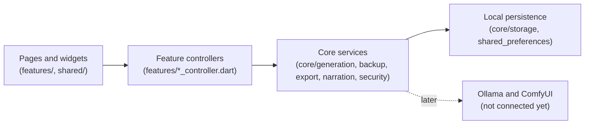

# Codebase map

This document explains every source file in the repository, which feature it
belongs to, and the architecture rules that keep the app maintainable. Update
it whenever a file is added, moved, or changes responsibility.

## Architecture

The dependency direction is one-way. Widgets never touch storage, crypto, or
generation directly; they go through a feature controller, which uses a core
service, which uses local storage.

Rules that every change must respect:

- Widgets read state through Riverpod providers and call controller commands;
  they never construct services or repositories.
- Each feature has its own controller. `AppController` only loads and commits
  already-validated snapshots; it does not grow feature logic.
- Core services are Flutter-framework-light and platform-boundary focused so
  they stay unit-testable without a device.
- Stored JSON is validated on read (`AppState.validated`); corrupt local data
  surfaces as a typed error instead of being silently overwritten.
- User-reachable "that no longer exists" states throw `Exception` subtypes such
  as `UnknownEntityException` so screens can recover; only genuine programming
  bugs stay `Error`s.
- Expensive Argon2id work goes through `compute` with a top-level entry point,
  and the services keep an injectable deriver so tests can skip the isolate.
- Everything is free and local: no accounts, no analytics, no network client,
  no paid or required cloud service.
- All authored public APIs carry `///` documentation (`public_member_api_docs`
  is enforced by the analyzer).

## Entry point and app frame — `lib/app/`, `lib/main.dart`

| File | Responsibility |
| --- | --- |
| `lib/main.dart` | Boots the Flutter binding and runs the root widget inside a Riverpod `ProviderScope`. |
| `lib/app/iam_hero_app.dart` | Root `MaterialApp.router` widget; binds the persisted locale and active-profile theme to the routed application. |
| `lib/app/app_controller.dart` | Loads the complete persisted `AppState` on startup and commits snapshots that feature controllers have already persisted. Also hosts the `storyGeneratorProvider` and repository/service providers. |
| `lib/app/app_router.dart` | go_router configuration: all routes, the shell wrapper, and parent-PIN gating for parent-only destinations (`/settings`, `/kingdom`, `/profiles`, `/review`, `/generation`). |
| `lib/app/app_shell.dart` | Responsive navigation frame around every route: app bar plus drawer and bottom navigation on mobile, extended rail on desktop widths (≥ 900 px). |
| `lib/app/app_theme.dart` | The shared visual system: dark palette, per-child color schemes (rose for girls, cyan for boys, plus saved custom colors), typography, component themes, and the reader's bedtime prose, surface, and warm page wash. |

## Domain models — `lib/core/models/`

| File | Responsibility |
| --- | --- |
| `app_language.dart` | The four supported languages (English, Arabic, Swedish, Somali) with ISO codes, used for both interface chrome and story text. |
| `app_state.dart` | The complete persisted application snapshot: `schemaVersion`, locale, profiles, active profile, and stories. `AppState.validated` enforces uniqueness, referential integrity (every story belongs to an existing profile), and newest-first story order. Writes version 4 (reading comfort and reading rewards; 3 added kingdom personalization, 2 added birth dates), reads versions 1 through 4, and refuses anything newer with `UnsupportedSchemaVersionException`. `requireSupportedAppStateSchemaVersion` is shared with the single-story share payload. |
| `child_profile.dart` | One child's private profile: name, optional `birthDate` plus the legacy stored age it replaced, required Girl/Boy choice, optional base64 reference photo (≤ 2 MB), saved theme color, story preferences, the `KingdomTheme` decoration, `ChildReadingSettings`, and the identities of stories finished on this device. `ageOn`/`age` compute a birthday-accurate age and fall back to the legacy value. Every `with…` transformation goes through one private copy helper so a newly stored field cannot be dropped. Includes the validated editor form model. |
| `child_reading_settings.dart` | Per-child reading comfort: the four `ReaderTextSize` steps (scaling the theme body size) and the easy-reading font switch, which resolves to the bundled Latin-script family and stays absent for Arabic. Deliberately separate from `child_story_preferences.dart`, which is prompt context copied into every generated story. |
| `reading_badge.dart` | The 1, 5, 10, and 25 finished-story badges plus the pure helpers for badges earned, the badge reached exactly now, and the next one. Counts only: no streaks, dates, or daily goals. |
| `shared_story.dart` | Payload of one encrypted single-story file: snapshot `schemaVersion`, the complete `StoryBook`, and the hero's display name for the import preview. Carries no photo and no other profile field. Also owns `DuplicateStoryException`, raised when an imported story identity already exists locally. |
| `kingdom_theme.dart` | One child's My Kingdom decoration: castle style, avatar frame, backdrop flavor, and favourite symbol. Every choice is optional and enum-name encoded; an absent field decodes to its default and an unknown stored name is refused with a `FormatException`. |
| `unknown_entity_exception.dart` | `UnknownEntityException`, the recoverable error thrown when a command targets a profile, story, or queued job that no longer exists locally. |
| `child_story_preferences.dart` | Per-child story defaults chosen by the parent: favorite topics, recurring story world, default story language, and `SafetyTopic` exclusions destined for future local AI prompts. |
| `generation_job.dart` | One durable story-generation request with lifecycle states (`queued`, `running`, `failed`, `cancelled`). Jobs survive app restarts so requests are never silently lost. |
| `story_models.dart` | Everything a story is made of: `StoryLength` (6/8/10 pages), `IllustrationStyle`, `StoryReviewStatus` (draft/approved), `StoryHero`, `StoryPrompt` (with legacy-JSON migration), `StoryPresentation`, `StoryRequest`, `StoryPage` (prose plus a `sceneDescription` reserved for ComfyUI), `StoryContent`, and the persisted `StoryBook` with favorites and collection labels. `withProfileId` re-attaches a whole book to another local profile, which is how an imported story file joins a chosen child's shelf. |

## Core services — `lib/core/`

### Generation — `core/generation/`

| File | Responsibility |
| --- | --- |
| `story_generator.dart` | The `StoryGenerator` boundary: `generate(StoryRequest) → StoryBook`. Implemented by the demo generator today and by the local Ollama/ComfyUI adapter later (see `docs/LOCAL_AI_INTEGRATION.md`). |
| `demo_story_generator.dart` | Clearly labeled offline sample generator. Produces deterministic, gender-aware prose in all four languages, weaves in the child's saved preferences and recurring world, and must never be presented as AI output. |

### Storage — `core/storage/`

| File | Responsibility |
| --- | --- |
| `local_repository.dart` | The only code that touches `shared_preferences`. Persists locale, profiles, stories, the generation queue, and the stored schema version; validates on load; `replaceState` swaps the whole snapshot during a backup restore while preserving the device's parent PIN, and rolls every replaced key back if any write fails midway. |

### Backup — `core/backup/`

| File | Responsibility |
| --- | --- |
| `encrypted_backup_codec.dart` | The shared `EncryptedEnvelopeCodec` — Argon2id key derivation (19 MiB, t=2, p=1) on a background isolate plus AES-256-GCM, with the envelope's format name and authenticated associated data supplied per payload type — and `EncryptedBackupCodec`, which uses it for portable `.iamhero` family snapshots. Typed exceptions distinguish wrong password, malformed or foreign file, oversized input (64 MiB cap), and a snapshot from a newer app version. |
| `story_share_codec.dart` | Encrypts and validates one `.iamhero-story` file on the same envelope with a distinct format name and associated data, so a story file and a full backup can never be opened as each other even under the same password. |
| `backup_file_service.dart` | Platform file flow for backups: save and pick encrypted files on Android, iOS, and web through `file_picker`. |
| `story_share_file_service.dart` | Platform file flow for single-story files: pick and save `.iamhero-story` on Android, iOS, and web, reusing the backup size cap and read error, with a bounded safe file name derived from the story title. |

### PDF export — `core/export/`

| File | Responsibility |
| --- | --- |
| `story_pdf_service.dart` | Renders one approved story as an A4 PDF entirely on-device using bundled Noto fonts: RTL layout and Naskh script for Arabic, Latin script for the others. Places the child's photo on the cover only when the parent asked for it at export time, and never on inner pages. Loads fonts sequentially because concurrent `rootBundle.load` calls resolve empty under the test binding. |
| `pdf_file_service.dart` | Opens the platform save dialog for a rendered PDF and produces a safe, bounded file name from the story title. |

### Narration — `core/narration/`

| File | Responsibility |
| --- | --- |
| `narration_service.dart` | Device text-to-speech boundary (`supports`, `speak`, `stop`) so the reader never depends on a TTS plugin directly. Deliberately thin: one utterance at a time, with completion the only progress signal required from a platform. |
| `device_narration_service.dart` | The real implementation using voices already installed on the device; free and offline. |
| `narration_options.dart` | Validated narration settings: speech speed presets, narration scope (current page or rest of story), the off/5/10/20-minute `NarrationSleepTimer`, and the `NarrationRequest` value passed across the boundary. |
| `sentence_splitter.dart` | Pure sentence splitter shared by narration and the reader highlight. Splits on `.` `!` `?` `؟` `…` and line breaks, keeps a run of terminators with its sentence, drops blank fragments, and reports each sentence's offsets inside the original page text so the highlight never rewrites the story. |

### Parent security — `core/security/`

| File | Responsibility |
| --- | --- |
| `parent_security.dart` | The stored PIN verifier record (version, salt, Argon2id verifier — never the PIN) plus its failed-attempt counter and cooldown, the escalating throttling policy (5 free attempts, then 30 s / 1 m / 2 m / 5 m cap), the in-memory parent access state, and the typed attempt result. Version-1 records still decode as having no attempt history. |
| `parent_security_service.dart` | Hashes and verifies the optional 4–8 digit parent PIN with Argon2id and a constant-time comparison, deriving on a background isolate through an injectable deriver. |

## Features — `lib/features/`

### Home — `features/home/`

| File | Responsibility |
| --- | --- |
| `home_page.dart` | Personalized dashboard: profile setup prompt for new families, primary create-story action, and the most recent approved books. |

### Profiles — `features/profile/`

| File | Responsibility |
| --- | --- |
| `profile_controller.dart` | Commands for child identity: add/edit/delete profiles, active-profile switching, gender, theme color, story preferences, the kingdom decoration, reading comfort, and the reading-reward history (`recordFinishedStory` returns the badge just earned; `forgetFinishedStory` drops a deleted story from every child). Resolves the saved birth date and rejects any resulting age outside 1–17, while letting a legacy age-only profile keep its stored age. New profiles seed their default story language from the current locale. |
| `profile_page.dart` | Profile list and the editor form (name, localized birth-date picker bounded to ages 1–17, Girl/Boy choice, reference photo). |

### My Kingdom — `features/kingdom/`

| File | Responsibility |
| --- | --- |
| `my_kingdom_page.dart` | Family hub for switching the active hero and personalizing each child's app color palette, plus the active child's castle header, framed avatar, favourite symbol, and page backdrop. |
| `kingdom_style_card.dart` | Parent-editable castle, photo frame, backdrop, and favourite-symbol choices for the active child. Each selection persists immediately through `ProfileController` and confirms with a snackbar. |
| `kingdom_decorations.dart` | Every kingdom decoration drawn locally: `KingdomCastle` and the framed `KingdomAvatar` (`CustomPaint`), the backdrop gradient, and the bounded Material icon for each favourite symbol. Adds no binary asset and makes no network call. |
| `story_preferences_card.dart` | Parent-editable per-child story preferences: favorite topics, recurring world, default language, and safety-topic exclusions, with a four-language chip dialog. Also hosts the reading-comfort controls (text size and easy-reading font), which save immediately and state that Arabic prose keeps its usual letters. |
| `reading_rewards_card.dart` | The active child's finished-story count, all four badges drawn with Material icons, and progress toward the next badge. Read-only and count-based; no streaks or dates are shown because none are stored. |

### Story creation — `features/story_creation/`

| File | Responsibility |
| --- | --- |
| `story_creation_page.dart` | Guided request form: hero selection, Girl/Boy confirmation, theme, moral, language, length, and illustration style, with a persistent notice that generation is currently the offline demo. |
| `story_controller.dart` | Owns the generation transaction: validates the request, enqueues a durable job, runs the generator, and persists the finished draft atomically — a failed generation writes no story. Deleted profiles and stories surface as `UnknownEntityException`. |
| `generation_queue_controller.dart` | Persists the generation queue independently of app state so interrupted or failed requests survive restarts and can be retried or cancelled. Commands for a job that no longer exists raise `UnknownEntityException`. |
| `generation_center_page.dart` | Parent-only generation center: honest capability report (demo ready; Ollama and ComfyUI not connected yet) plus retry/cancel controls for queued jobs. |

### Parent review — `features/review/`

| File | Responsibility |
| --- | --- |
| `story_review_page.dart` | Parent-only draft queue and full-text review surface. Every generated story starts as a draft, invisible to the child, until the parent approves or deletes it. The page preview uses the hero's saved reading comfort so the parent reads what the child will read. Approval opens the reader. |

### Library — `features/library/`

| File | Responsibility |
| --- | --- |
| `story_library_page.dart` | The bookshelf: per-child tabs carrying each child's favourite symbol when multiple profiles exist, favorites and collection filters, a parent-only badge when drafts await review, the import-story-file action, and story deletion and sharing behind the parent gate. |
| `story_collections_dialog.dart` | Editor for a story's collection labels (for example bedtime, learning, adventures) with bounded, deduplicated parsing. |
| `story_share_controller.dart` | Commands for single-story files: encrypt one stored story with its hero name, save or pick the file, decrypt a selected file, and import it into a chosen profile. Refuses an already present story identity (`DuplicateStoryException`) and a destination profile that no longer exists (`UnknownEntityException`). |
| `story_share_actions.dart` | The parent-gated export and import flows: password prompt, decrypted preview (title, page count, hero), destination-profile choice, and one localized message per typed failure. Talks only to `StoryShareController`. |

### Reader — `features/reader/`

| File | Responsibility |
| --- | --- |
| `story_reader_page.dart` | Full-screen reader: swipeable pages, placeholder illustrations until ComfyUI, narration play/pause/stop with the spoken sentence tinted in place, speed, scope and sleep-timer settings, Arabic RTL story layout, the child's saved text size and easy-reading font, the session-only bedtime toggle, and PDF export behind a small dialog asking whether the cover carries the child's photo. Reaching the last page records the story as finished once per session and celebrates a newly earned badge. The control bar moves page progress above a wrapping action row below 560 px so a 360 px phone keeps full touch targets. Only approved stories can be opened. |
| `narration_controller.dart` | Owns the reader's sentence queue, position, playback state, and sleep timer above the `NarrationService` boundary: speaks one sentence per utterance, pauses by remembering the sentence and resuming from its start, follows rest-of-story narration onto the next page, and stops when the reader turns to a page the queue did not ask for. The clock and countdown are injectable so all of it is testable without a device. |
| `story_export_controller.dart` | Coordinates PDF rendering and the save dialog; refuses to export unapproved drafts and resolves the hero's photo only when the parent opted in. |

### Settings — `features/settings/`

| File | Responsibility |
| --- | --- |
| `settings_page.dart` | Language selection, backup, parent PIN, and the deliberate delete-all-family-data action. |
| `settings_controller.dart` | Locale persistence and the delete-everything transaction. |
| `backup_controller.dart` | Orchestrates export (state → encrypt → save file) and restore (pick file → decrypt → preview counts → replace state → refresh queue). |
| `backup_settings_card.dart` | Backup UI: password dialogs with confirmation, restore preview, and distinct localized error messages per failure type, including a backup written by a newer app version. |
| `parent_access_controller.dart` | Owns PIN persistence, the throttled attempt policy, the injectable clock, and the session unlock/lock state used by gates. A `WidgetsBindingObserver` re-locks the session when the app is paused or hidden. |
| `parent_security_settings_card.dart` | PIN status, setup, two-step Change PIN (current PIN then the new one twice), re-lock, removal controls, and the note that a forgotten PIN has no recovery. |

## Shared widgets — `lib/shared/`

| File | Responsibility |
| --- | --- |
| `app_state_boundary.dart` | Standard loading/error boundary every page uses around persisted state. |
| `parent_access_gate.dart` | Two parent-PIN surfaces: a full-page gate for parent-only routes and a modal prompt for destructive actions (deletion, export, collection edits). Refuses input while a cooldown is stored and shows the remaining wait; PIN fields never retain the secret. Also owns the shared localization of one attempt outcome. |
| `gender_selector.dart` | The required Girl/Boy selector shared by profile and story forms. |
| `app_language_dropdown.dart` | Four-language dropdown with ISO badges, shared by app settings and story settings. |
| `screen_layout.dart` | Width-constrained page scaffold, hero gradient card, and section headings. Accepts an optional per-page backdrop gradient, used by My Kingdom for the active child's chosen flavor. |
| `story_card.dart` | Library card with cover treatment, demo badge, and the favorite, collections, share, and delete commands its surrounding feature allows. The open action owns a full-width row and the icons wrap below it, so a one-column shelf on a 360 px phone keeps full touch targets. |
| `encryption_password_dialog.dart` | The password prompt shared by encrypted backups and single-story files, with per-file localized wording, optional confirmation field, the shared minimum length, and controllers that discard the secret with the modal. |
| `reading_text_style.dart` | Resolves story prose typography from one child's reading comfort by scaling the theme body size and requesting the easy-reading family only for Latin script. Shared by the reader and the review preview. |
| `reading_badge_view.dart` | The bounded Material icon and localized name of one reading badge, shared by My Kingdom and the reader's congratulation message. |

## Localization — `lib/l10n/`

| File | Responsibility |
| --- | --- |
| `app_en.arb`, `app_ar.arb`, `app_sv.arb`, `app_so.arb` | The four source translation files. Every user-visible string lives here; add new strings to all four. |
| `app_localizations*.dart` | Generated by `flutter gen-l10n` — never edit by hand. |
| `somali_platform_localizations.dart` | Hand-written Material/Cupertino localization delegate for Somali, which Flutter does not ship. |

## Assets — `assets/`

| Path | Responsibility |
| --- | --- |
| `assets/fonts/NotoSans-Regular.ttf` | Latin-script font embedded only for offline PDF export (English, Swedish, Somali). |
| `assets/fonts/NotoNaskhArabic-Regular.ttf` | Arabic-script font embedded only for offline PDF export. |
| `assets/fonts/AtkinsonHyperlegible-Regular.ttf` | Latin-script easy-reading font used only by the optional per-child reader setting; regular weight only. |
| `assets/fonts/OFL.txt`, `assets/fonts/OFL-AtkinsonHyperlegible.txt`, `assets/fonts/README.md` | SIL Open Font License texts and provenance notes for the bundled fonts. |

## Tests — `test/`

| File | What it proves |
| --- | --- |
| `test/app/iam_hero_app_test.dart` | End-to-end widget flows: onboarding, profile creation, choosing a birth date for a legacy age-only profile, story creation through review and approval into the reader, per-child library tabs, theme restoration, and localization. |
| `test/core/generation/demo_story_generator_test.dart` | Demo stories respect language, page count, gender context, and saved child preferences; requests without a gender choice are rejected. |
| `test/core/models/child_profile_test.dart` | Legacy age-only profiles still decode, ages count the birthday itself (including leap-day children), and malformed, future, or too-recent birth dates are refused at the storage boundary. |
| `test/core/storage/local_repository_test.dart` | Real persistence round-trips, legacy-JSON migration, corrupt-data surfacing, `replaceState` preserving the parent PIN while clearing the queue, an end-to-end encrypted restore, rollback when a preference write fails midway, and refusal of a newer-schema backup. |
| `test/core/backup/encrypted_backup_codec_test.dart` | Backup round-trip fidelity including birth dates, wrong-password rejection, tamper (bit-flip) detection, unsupported-version rejection, and that plaintext never appears in the ciphertext. |
| `test/core/export/story_pdf_service_test.dart` | A valid PDF renders offline for each of the four story languages using the bundled fonts, with and without the optional cover photo, and an unreadable photo falls back to the photo-free cover. |
| `test/core/security/parent_security_service_test.dart` | The stored verifier accepts only the original PIN and never contains the PIN itself. |
| `test/core/security/parent_security_test.dart` | The attempt counter and escalating cooldown policy, that success clears both, and that version-1 records decode with no attempt history. |
| `test/features/settings/parent_access_controller_test.dart` | Five wrong PINs start a cooldown that escalates and survives a restart, the correct PIN unlocks once it elapses, Change PIN requires the current PIN, and backgrounding re-locks the session. |
| `test/features/story_creation/generation_queue_controller_test.dart` | A request interrupted mid-run reopens as a durable queued job after restart. |
| `test/features/story_creation/story_controller_test.dart` | Retrying, cancelling, favouriting, or generating for deleted content fails as a catchable `Exception` instead of crashing the screen. |
| `test/shared/parent_access_gate_test.dart` | A configured PIN hides settings, a wrong PIN keeps them hidden, the right PIN opens them, and repeated wrong PINs refuse input with the remaining wait. |
| `test/core/narration/sentence_splitter_test.dart` | Pages split the way they are read aloud: English terminators, the Arabic `؟`, ellipses and terminator runs, line breaks, a single-sentence page, blank pages, and offsets that still point at the original characters. |
| `test/features/reader/narration_controller_test.dart` | Sentences are spoken in order, pause freezes the position while resume repeats that sentence, stop clears the queue, an unrequested page turn stops narration while rest-of-story follows the queue onto the next page, an injected sleep timer stops narration at expiry, and the selected speed reaches the boundary. |
| `test/features/reader/story_reader_narration_test.dart` | What the reader sees: starting narration tints the first sentence and advances it, pausing keeps the sentence and resuming re-speaks it, stopping clears the tint and hides the stop control, and the settings dialog offers the sleep timer. |
| `test/core/models/kingdom_theme_test.dart` | Kingdom decoration round-trips through JSON, an absent field decodes to its default, an unknown stored name is refused, a profile keeps its decoration through an encrypted backup, and snapshots are written at schema version 3 while version 4 is refused. |
| `test/features/kingdom/my_kingdom_page_test.dart` | Choosing a castle, frame, backdrop, or symbol saves it and re-renders My Kingdom, and a second hero keeps decoration choices independent of the first. |
| `test/core/models/child_reading_settings_test.dart` | Reading comfort round-trips, absent fields decode to the defaults, unknown values are refused, the easy font applies to Latin script only, the size steps grow, and a pre-comfort profile keeps the defaults with an empty reward history. |
| `test/core/backup/story_share_codec_test.dart` | A shared story round-trips with its review status and collections, the payload never contains a photo, a wrong password and a bit flip both fail, a backup and a story file each refuse the other's decoder, a newer payload is refused, and an imported story is re-attached to the chosen profile. |
| `test/features/library/story_share_test.dart` | Importing writes the story to the chosen profile only, the same story twice is refused, an export carries the local hero name and no photo, and through the real library UI a picked file is previewed, imported, and opened in the reader while a full backup is refused with a localized message. |
| `test/features/reader/story_reader_comfort_test.dart` | The reader scales prose by the saved text size, uses the easy font for English but never for Arabic, mirrors both in the review preview, ships that font in the asset bundle, and bedtime mode warms the page, dims the prose, and picks the ten-minute sleep timer unless the parent already chose one. |
| `test/features/kingdom/reading_rewards_test.dart` | Badge thresholds, finishing a story counting once with the badge reported, no badge between thresholds, deletion dropping a story from the reward history, and the reader celebrating the first badge once while My Kingdom shows the count and the next milestone. |

## Documentation — `docs/`

| File | Responsibility |
| --- | --- |
| `docs/CODEBASE.md` | This file. |
| `docs/LOCAL_AI_INTEGRATION.md` | The contract for the future local Ollama and ComfyUI phase: the `StoryGenerator` boundary, failure semantics, and privacy constraints. |

## Feature → file quick reference

| Feature | Main files |
| --- | --- |
| Child profiles, birth dates, and photos | `core/models/child_profile.dart`, `features/profile/*` |
| Per-child themes | `app/app_theme.dart`, `features/kingdom/my_kingdom_page.dart`, `features/profile/profile_controller.dart` |
| Story creation (demo) | `features/story_creation/*`, `core/generation/*` |
| Durable generation queue | `core/models/generation_job.dart`, `features/story_creation/generation_queue_controller.dart`, `generation_center_page.dart` |
| Parent review of drafts | `core/models/story_models.dart` (`StoryReviewStatus`), `features/review/story_review_page.dart` |
| Library, favorites, collections | `features/library/*`, `shared/story_card.dart` |
| Reader and narration | `features/reader/story_reader_page.dart`, `features/reader/narration_controller.dart`, `core/narration/*` |
| My Kingdom personalization | `core/models/kingdom_theme.dart`, `features/kingdom/kingdom_style_card.dart`, `kingdom_decorations.dart`, `features/profile/profile_controller.dart` |
| PDF export | `core/export/*`, `features/reader/story_export_controller.dart`, `assets/fonts/` |
| Parent PIN | `core/security/*`, `features/settings/parent_access_controller.dart`, `parent_security_settings_card.dart`, `shared/parent_access_gate.dart` |
| Encrypted backup and restore | `core/backup/*`, `features/settings/backup_controller.dart`, `backup_settings_card.dart`, `shared/encryption_password_dialog.dart` |
| Single-story sharing | `core/models/shared_story.dart`, `core/backup/story_share_codec.dart`, `story_share_file_service.dart`, `features/library/story_share_controller.dart`, `story_share_actions.dart` |
| Reading comfort | `core/models/child_reading_settings.dart`, `shared/reading_text_style.dart`, `features/kingdom/story_preferences_card.dart`, `features/reader/story_reader_page.dart`, `features/review/story_review_page.dart`, `assets/fonts/` |
| Reading rewards | `core/models/reading_badge.dart`, `shared/reading_badge_view.dart`, `features/kingdom/reading_rewards_card.dart`, `features/profile/profile_controller.dart`, `features/reader/story_reader_page.dart` |
| Bedtime mode | `features/reader/story_reader_page.dart`, `app/app_theme.dart`, `core/narration/narration_options.dart` |
| Schema versioning and migrations | `core/models/app_state.dart`, `core/storage/local_repository.dart` |
| Per-child story preferences and safety topics | `core/models/child_story_preferences.dart`, `features/kingdom/story_preferences_card.dart` |
| Localization (en/ar/sv/so) | `lib/l10n/*` |
| Local AI (future) | `docs/LOCAL_AI_INTEGRATION.md`, `core/generation/story_generator.dart` |
