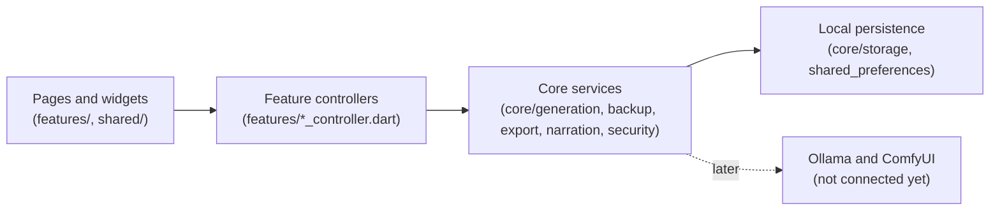

# Codebase map

This document explains every source file in the repository, which feature it
belongs to, and the architecture rules that keep the app maintainable. Update
it whenever a file is added, moved, or changes responsibility.

## Architecture

The dependency direction is one-way. Widgets never touch storage, crypto, or
generation directly; they go through a feature controller, which uses a core
service, which uses local storage.

Rules that every change must respect:

- Widgets read state through Riverpod providers and call controller commands;
  they never construct services or repositories.
- Each feature has its own controller. `AppController` only loads and commits
  already-validated snapshots; it does not grow feature logic.
- Core services are Flutter-framework-light and platform-boundary focused so
  they stay unit-testable without a device.
- Stored JSON is validated on read (`AppState.validated`); corrupt local data
  surfaces as a typed error instead of being silently overwritten.
- Everything is free and local: no accounts, no analytics, no network client,
  no paid or required cloud service.
- All authored public APIs carry `///` documentation (`public_member_api_docs`
  is enforced by the analyzer).

## Entry point and app frame — `lib/app/`, `lib/main.dart`

| File | Responsibility |
| --- | --- |
| `lib/main.dart` | Boots the Flutter binding and runs the root widget inside a Riverpod `ProviderScope`. |
| `lib/app/iam_hero_app.dart` | Root `MaterialApp.router` widget; binds the persisted locale and active-profile theme to the routed application. |
| `lib/app/app_controller.dart` | Loads the complete persisted `AppState` on startup and commits snapshots that feature controllers have already persisted. Also hosts the `storyGeneratorProvider` and repository/service providers. |
| `lib/app/app_router.dart` | go_router configuration: all routes, the shell wrapper, and parent-PIN gating for parent-only destinations (`/settings`, `/kingdom`, `/profiles`, `/review`, `/generation`). |
| `lib/app/app_shell.dart` | Responsive navigation frame around every route: app bar plus drawer and bottom navigation on mobile, extended rail on desktop widths (≥ 900 px). |
| `lib/app/app_theme.dart` | The shared visual system: dark palette, per-child color schemes (rose for girls, cyan for boys, plus saved custom colors), typography, and component themes. |

## Domain models — `lib/core/models/`

| File | Responsibility |
| --- | --- |
| `app_language.dart` | The four supported languages (English, Arabic, Swedish, Somali) with ISO codes, used for both interface chrome and story text. |
| `app_state.dart` | The complete persisted application snapshot: locale, profiles, active profile, and stories. `AppState.validated` enforces uniqueness, referential integrity (every story belongs to an existing profile), and newest-first story order. |
| `child_profile.dart` | One child's private profile: name, age, required Girl/Boy choice, optional base64 reference photo (≤ 2 MB), saved theme color, and story preferences. Includes the validated editor form model. |
| `child_story_preferences.dart` | Per-child story defaults chosen by the parent: favorite topics, recurring story world, default story language, and `SafetyTopic` exclusions destined for future local AI prompts. |
| `generation_job.dart` | One durable story-generation request with lifecycle states (`queued`, `running`, `failed`, `cancelled`). Jobs survive app restarts so requests are never silently lost. |
| `story_models.dart` | Everything a story is made of: `StoryLength` (6/8/10 pages), `IllustrationStyle`, `StoryReviewStatus` (draft/approved), `StoryHero`, `StoryPrompt` (with legacy-JSON migration), `StoryPresentation`, `StoryRequest`, `StoryPage` (prose plus a `sceneDescription` reserved for ComfyUI), `StoryContent`, and the persisted `StoryBook` with favorites and collection labels. |

## Core services — `lib/core/`

### Generation — `core/generation/`

| File | Responsibility |
| --- | --- |
| `story_generator.dart` | The `StoryGenerator` boundary: `generate(StoryRequest) → StoryBook`. Implemented by the demo generator today and by the local Ollama/ComfyUI adapter later (see `docs/LOCAL_AI_INTEGRATION.md`). |
| `demo_story_generator.dart` | Clearly labeled offline sample generator. Produces deterministic, gender-aware prose in all four languages, weaves in the child's saved preferences and recurring world, and must never be presented as AI output. |

### Storage — `core/storage/`

| File | Responsibility |
| --- | --- |
| `local_repository.dart` | The only code that touches `shared_preferences`. Persists locale, profiles, stories, and the generation queue; validates on load; `replaceState` swaps the whole snapshot during a backup restore while preserving the device's parent PIN. |

### Backup — `core/backup/`

| File | Responsibility |
| --- | --- |
| `encrypted_backup_codec.dart` | Encrypts and decrypts portable `.iamhero` family snapshots: Argon2id key derivation (19 MiB, t=2, p=1) plus AES-256-GCM with authenticated envelope data. Typed exceptions distinguish wrong password, malformed file, and oversized input (64 MiB cap). |
| `backup_file_service.dart` | Platform file flow for backups: save and pick encrypted files on Android, iOS, and web through `file_picker`. |

### PDF export — `core/export/`

| File | Responsibility |
| --- | --- |
| `story_pdf_service.dart` | Renders one approved story as an A4 PDF entirely on-device using bundled Noto fonts: RTL layout and Naskh script for Arabic, Latin script for the others. The child's photo is deliberately excluded from the PDF. |
| `pdf_file_service.dart` | Opens the platform save dialog for a rendered PDF and produces a safe, bounded file name from the story title. |

### Narration — `core/narration/`

| File | Responsibility |
| --- | --- |
| `narration_service.dart` | Device text-to-speech boundary (`supports`, `speak`, `stop`) so the reader never depends on a TTS plugin directly. |
| `device_narration_service.dart` | The real implementation using voices already installed on the device; free and offline. |
| `narration_options.dart` | Validated narration settings: speech speed presets, narration scope (current page or rest of story), and the `NarrationRequest` value passed across the boundary. |

### Parent security — `core/security/`

| File | Responsibility |
| --- | --- |
| `parent_security.dart` | The stored PIN verifier record (version, salt, Argon2id verifier — never the PIN) and the in-memory parent access state. |
| `parent_security_service.dart` | Hashes and verifies the optional 4–8 digit parent PIN with Argon2id and a constant-time comparison. |

## Features — `lib/features/`

### Home — `features/home/`

| File | Responsibility |
| --- | --- |
| `home_page.dart` | Personalized dashboard: profile setup prompt for new families, primary create-story action, and the most recent approved books. |

### Profiles — `features/profile/`

| File | Responsibility |
| --- | --- |
| `profile_controller.dart` | Commands for child identity: add/edit/delete profiles, active-profile switching, gender, theme color, and story preferences. New profiles seed their default story language from the current locale. |
| `profile_page.dart` | Profile list and the editor form (name, age, Girl/Boy choice, reference photo). |

### My Kingdom — `features/kingdom/`

| File | Responsibility |
| --- | --- |
| `my_kingdom_page.dart` | Family hub for switching the active hero and personalizing each child's app color palette. |
| `story_preferences_card.dart` | Parent-editable per-child story preferences: favorite topics, recurring world, default language, and safety-topic exclusions, with a four-language chip dialog. |

### Story creation — `features/story_creation/`

| File | Responsibility |
| --- | --- |
| `story_creation_page.dart` | Guided request form: hero selection, Girl/Boy confirmation, theme, moral, language, length, and illustration style, with a persistent notice that generation is currently the offline demo. |
| `story_controller.dart` | Owns the generation transaction: validates the request, enqueues a durable job, runs the generator, and persists the finished draft atomically — a failed generation writes no story. |
| `generation_queue_controller.dart` | Persists the generation queue independently of app state so interrupted or failed requests survive restarts and can be retried or cancelled. |
| `generation_center_page.dart` | Parent-only generation center: honest capability report (demo ready; Ollama and ComfyUI not connected yet) plus retry/cancel controls for queued jobs. |

### Parent review — `features/review/`

| File | Responsibility |
| --- | --- |
| `story_review_page.dart` | Parent-only draft queue and full-text review surface. Every generated story starts as a draft, invisible to the child, until the parent approves or deletes it. Approval opens the reader. |

### Library — `features/library/`

| File | Responsibility |
| --- | --- |
| `story_library_page.dart` | The bookshelf: per-child tabs when multiple profiles exist, favorites and collection filters, a parent-only badge when drafts await review, and story deletion behind the parent gate. |
| `story_collections_dialog.dart` | Editor for a story's collection labels (for example bedtime, learning, adventures) with bounded, deduplicated parsing. |

### Reader — `features/reader/`

| File | Responsibility |
| --- | --- |
| `story_reader_page.dart` | Full-screen reader: swipeable pages, placeholder illustrations until ComfyUI, device narration with speed and scope settings, Arabic RTL story layout, and PDF export. Only approved stories can be opened. |
| `story_export_controller.dart` | Coordinates PDF rendering and the save dialog; refuses to export unapproved drafts. |

### Settings — `features/settings/`

| File | Responsibility |
| --- | --- |
| `settings_page.dart` | Language selection, backup, parent PIN, and the deliberate delete-all-family-data action. |
| `settings_controller.dart` | Locale persistence and the delete-everything transaction. |
| `backup_controller.dart` | Orchestrates export (state → encrypt → save file) and restore (pick file → decrypt → preview counts → replace state → refresh queue). |
| `backup_settings_card.dart` | Backup UI: password dialogs with confirmation, restore preview, and distinct localized error messages per failure type. |
| `parent_access_controller.dart` | Owns PIN persistence and the session unlock/lock state used by gates. |
| `parent_security_settings_card.dart` | PIN status, setup, re-lock, and removal controls. |

## Shared widgets — `lib/shared/`

| File | Responsibility |
| --- | --- |
| `app_state_boundary.dart` | Standard loading/error boundary every page uses around persisted state. |
| `parent_access_gate.dart` | Two parent-PIN surfaces: a full-page gate for parent-only routes and a modal prompt for destructive actions (deletion, export, collection edits). PIN fields never retain the secret. |
| `gender_selector.dart` | The required Girl/Boy selector shared by profile and story forms. |
| `app_language_dropdown.dart` | Four-language dropdown with ISO badges, shared by app settings and story settings. |
| `screen_layout.dart` | Width-constrained page scaffold, hero gradient card, and section headings. |
| `story_card.dart` | Library card with cover treatment, demo badge, favorite toggle, collections, and delete commands. |

## Localization — `lib/l10n/`

| File | Responsibility |
| --- | --- |
| `app_en.arb`, `app_ar.arb`, `app_sv.arb`, `app_so.arb` | The four source translation files. Every user-visible string lives here; add new strings to all four. |
| `app_localizations*.dart` | Generated by `flutter gen-l10n` — never edit by hand. |
| `somali_platform_localizations.dart` | Hand-written Material/Cupertino localization delegate for Somali, which Flutter does not ship. |

## Assets — `assets/`

| Path | Responsibility |
| --- | --- |
| `assets/fonts/NotoSans-Regular.ttf` | Latin-script font embedded only for offline PDF export (English, Swedish, Somali). |
| `assets/fonts/NotoNaskhArabic-Regular.ttf` | Arabic-script font embedded only for offline PDF export. |
| `assets/fonts/OFL.txt`, `assets/fonts/README.md` | SIL Open Font License and provenance notes for the bundled fonts. |

## Tests — `test/`

| File | What it proves |
| --- | --- |
| `test/app/iam_hero_app_test.dart` | End-to-end widget flows: onboarding, profile creation, story creation through review and approval into the reader, per-child library tabs, theme restoration, and localization. |
| `test/core/generation/demo_story_generator_test.dart` | Demo stories respect language, page count, gender context, and saved child preferences; requests without a gender choice are rejected. |
| `test/core/storage/local_repository_test.dart` | Real persistence round-trips, legacy-JSON migration, corrupt-data surfacing, and `replaceState` preserving the parent PIN while clearing the queue. |
| `test/core/backup/encrypted_backup_codec_test.dart` | Backup round-trip fidelity, wrong-password rejection, tamper (bit-flip) detection, unsupported-version rejection, and that plaintext never appears in the ciphertext. |
| `test/core/export/story_pdf_service_test.dart` | A valid PDF renders offline for each of the four story languages using the bundled fonts. |
| `test/core/security/parent_security_service_test.dart` | The stored verifier accepts only the original PIN and never contains the PIN itself. |
| `test/features/story_creation/generation_queue_controller_test.dart` | A request interrupted mid-run reopens as a durable queued job after restart. |

## Documentation — `docs/`

| File | Responsibility |
| --- | --- |
| `docs/CODEBASE.md` | This file. |
| `docs/LOCAL_AI_INTEGRATION.md` | The contract for the future local Ollama and ComfyUI phase: the `StoryGenerator` boundary, failure semantics, and privacy constraints. |

## Feature → file quick reference

| Feature | Main files |
| --- | --- |
| Child profiles and photos | `core/models/child_profile.dart`, `features/profile/*` |
| Per-child themes | `app/app_theme.dart`, `features/kingdom/my_kingdom_page.dart`, `features/profile/profile_controller.dart` |
| Story creation (demo) | `features/story_creation/*`, `core/generation/*` |
| Durable generation queue | `core/models/generation_job.dart`, `features/story_creation/generation_queue_controller.dart`, `generation_center_page.dart` |
| Parent review of drafts | `core/models/story_models.dart` (`StoryReviewStatus`), `features/review/story_review_page.dart` |
| Library, favorites, collections | `features/library/*`, `shared/story_card.dart` |
| Reader and narration | `features/reader/story_reader_page.dart`, `core/narration/*` |
| PDF export | `core/export/*`, `features/reader/story_export_controller.dart`, `assets/fonts/` |
| Parent PIN | `core/security/*`, `features/settings/parent_access_controller.dart`, `parent_security_settings_card.dart`, `shared/parent_access_gate.dart` |
| Encrypted backup and restore | `core/backup/*`, `features/settings/backup_controller.dart`, `backup_settings_card.dart` |
| Per-child story preferences and safety topics | `core/models/child_story_preferences.dart`, `features/kingdom/story_preferences_card.dart` |
| Localization (en/ar/sv/so) | `lib/l10n/*` |
| Local AI (future) | `docs/LOCAL_AI_INTEGRATION.md`, `core/generation/story_generator.dart` |
