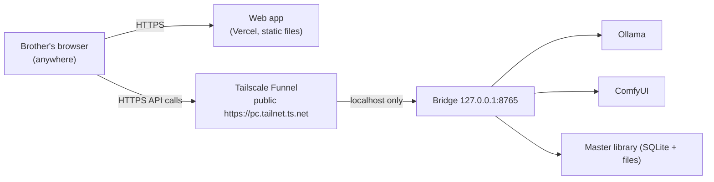

# Remote family access over the internet — complete guide (branch: tunnel)

A self-contained work order for an agent (or a person) on the **AI PC** — the
machine that runs the Iam-hero bridge, Ollama, and ComfyUI.

**Goal:** a family member anywhere in the world (e.g. Egypt, while the PC is
in Sweden) opens the hosted web app in a normal browser, pairs with this PC,
creates profiles for their own children, generates stories with illustrations,
and reads them — **without installing anything on their device**.

**Owner-accepted trade-off (do not "fix" it):** the bridge's URL becomes
publicly reachable. The pairing system is the gate: bearer tokens per device,
6-digit codes shown only on this PC's console, 2-minute expiry, 5 attempts.
Every paired device currently sees every profile and story; a login /
per-family feature is planned separately and is NOT part of this task. Do not
weaken pairing and do not set up router port forwarding.

## How it works



Tailscale Funnel gives this PC a permanent public HTTPS address with a real
certificate and forwards it to the bridge on localhost. No router changes, no
port forwarding, and it works behind carrier-grade NAT (shared ISP addresses,
common in many countries, where classic port forwarding cannot work at all).
TLS is terminated by the Tailscale daemon **on this PC**, so traffic is
encrypted end to end between the browser and this machine.

### Why not the alternatives

| Option | Verdict |
| --- | --- |
| Router port forwarding + dynamic DNS | Needs router access, breaks under carrier-grade NAT, exposes a raw port, still needs an HTTPS reverse proxy for the browser's mixed-content rule. More work, worse result. |
| Cloudflare Tunnel | Also good, but a stable hostname requires owning a domain, and TLS terminates on Cloudflare's servers (a third party sees the traffic). |
| Tailscale WITHOUT Funnel (private tailnet) | Most private option, but every family device must install Tailscale — rejected because remote users should need nothing installed. Documented in the appendix in case the owner changes their mind. |

## Prerequisites checklist

- [ ] The bridge runs and works on this PC (see `bridge/README.md`).
- [ ] The web app is deployed and its exact URL is known
      (`https://<app>.vercel.app` — scheme + host, no path).
- [ ] Admin rights on this PC to install Tailscale.
- [ ] A free Tailscale account (Google/Microsoft/GitHub sign-in works).

## Part 1 — install Tailscale on this PC

1. Install: `winget install Tailscale.Tailscale` (or the installer from
   tailscale.com/download). Sign in when it prompts.
2. In the admin console (login.tailscale.com):
   - **DNS tab → enable MagicDNS** (usually already on).
   - **DNS tab → HTTPS Certificates → Enable**.
3. Optional but recommended: rename the machine to something neutral
   (Machines → … → Edit machine name), e.g. `storybridge` — the name becomes
   part of a public URL and of public certificate-transparency logs, so keep
   family names out of it.

## Part 2 — publish the bridge with Funnel

1. Confirm the bridge port: `port` in `bridge_config.json` (default `8765`).
   Leave `bindAddress` on `127.0.0.1` — Funnel forwards locally; nothing else
   should change.
2. Run:

   ```
   tailscale funnel --bg 8765
   ```

   The first run may print a link to enable Funnel for the tailnet — open it
   and approve. (CLI syntax has moved between versions; `tailscale funnel
   --help` is authoritative. Older syntax was `tailscale serve https /
   http://127.0.0.1:8765` followed by `tailscale funnel 443 on`. The
   requirement is: public HTTPS on port 443 → local port 8765.)
3. `tailscale funnel status` prints the public URL:
   `https://<machine>.<tailnet>.ts.net`. Write it down — it is stable.
4. Test from a phone on **mobile data** (not the home Wi-Fi):
   `https://<machine>.<tailnet>.ts.net/health` must return the bridge's
   health JSON. First HTTPS request can take ~10 s while the certificate is
   issued; after that it is instant.
5. Reboot the PC once and re-check `tailscale funnel status` — `--bg`
   persists the funnel across restarts (Tailscale runs as a Windows service).

## Part 3 — allow the web app's origin in the bridge

Browsers only let the web app call the bridge if the bridge lists the app's
origin. In `bridge_config.json`:

```jsonc
{
  "bindAddress": "127.0.0.1",
  "port": 8765,
  // ...existing values stay as they are...
  "allowedWebOrigins": [
    "https://<your-app>.vercel.app"
  ]
}
```

- The origin must match the browser's address bar exactly: scheme + host (no
  trailing slash, no path). If the app is reachable under two URLs (e.g. a
  custom domain and the vercel.app one), list both.
- Loopback origins are always allowed automatically; nothing to add for use
  on the PC itself.
- Restart the bridge after editing. A typo in a key is refused at startup
  with a clear message.

## Part 4 — pair the remote family member (walkthrough to relay to them)

1. Open the web app link in any browser (phone or computer).
2. Go to the parent settings area (it may ask for the parent PIN of *their*
   device — that PIN is local to their browser and theirs to set).
3. Switch mode from Demo to Local AI, and enter the bridge address:
   `https://<machine>.<tailnet>.ts.net` — with https, no port, no slash.
4. Use "Test connection" — it should report the bridge, Ollama, and ComfyUI
   status.
5. Tap "Pair device". At that moment a **6-digit code appears on this PC's
   console** in Sweden. Send it to them (call/WhatsApp); they enter it
   **within 2 minutes**. Five wrong attempts kill the request — just start a
   new pairing.
6. Paired. They can now create profiles for their own children (name, birth
   date, photo), set story preferences, and generate stories with
   illustrations. Generation jobs from all devices share this PC's GPU,
   one at a time — a busy queue means waiting, not failure.
7. Tell them to use "Download stories for offline use" after generating:
   synced stories and illustrations are cached in their browser and remain
   readable **while this PC is off**. Only new generation and sync need the
   PC on.
8. Warn them: clearing browser site data deletes their offline copies (the
   master stays on this PC and can simply be re-synced).

## Part 5 — verification checklist

- [ ] From a device on mobile data: `/health` answers over the funnel URL.
- [ ] Web app on that device pairs successfully end to end.
- [ ] A short demo-length story generates and displays with illustrations.
- [ ] Bridge stopped briefly → the already-synced story still opens offline
      in the remote browser; the app clearly shows AI/sync unavailable.
- [ ] Unpaired access is refused: opening
      `https://<url>/library` directly (no token) returns an auth error, not
      data.
- [ ] After a PC reboot: funnel still on, bridge auto-starts (if the bridge
      is not set to auto-start, see `bridge/README.md` and set that up).

## Part 6 — keep the PC reachable

- Windows Settings → System → Power: set **Sleep: Never** while remote
  family should be able to generate (or agree on hours — Sweden and Egypt
  are only one hour apart).
- If the PC sleeps anyway, generation and sync fail cleanly and offline
  reading is unaffected; it resumes when the PC wakes.

## Troubleshooting

| Symptom | Likely cause | Fix |
| --- | --- | --- |
| Pair button does nothing; nothing on the PC console | Origin missing from `allowedWebOrigins` or typo'd | Compare with the browser address bar character by character; restart bridge |
| Browser console shows CORS errors | Same as above | Same |
| `funnel` command errors | HTTPS certs not enabled, or Funnel not approved for the tailnet | Part 1 step 2; approve the printed link |
| First remote request very slow | Certificate being issued on first use | Wait ~10 s, retry |
| "Too many pairing requests" | The global pairing rate limit (5/min) | Wait one minute; a future enhancement makes this per-peer |
| Code rejected | Expired (2 min) or 5 attempts used | Start a new pairing |
| Works at home, dead remotely | Funnel off or PC asleep | `tailscale funnel status`; Part 6 |
| Generation extremely slow for remote user | Queue busy (someone else's job on the GPU) | Expected; jobs run one at a time |

## Rollback / undo

- Stop public exposure: `tailscale funnel --bg off` (or `tailscale funnel
  reset`). The bridge instantly returns to localhost-only.
- Remove the web origin from `allowedWebOrigins` and restart the bridge.
- Remote devices can be unpaired from the bridge's device list; their cached
  stories remain readable on their devices (remove offline copies from the
  app if desired).

## Security notes and limits (owner is aware)

- The funnel URL is public; pairing is the only gate. Codes are short-lived
  and attempt-limited; tokens are 256-bit and stored hashed on the bridge.
- All paired devices share one library until the login feature lands.
- Tailscale Funnel has modest bandwidth limits — fine for story JSON and
  illustration images; it is not a video server.
- The `ts.net` hostname appears in public certificate-transparency logs
  (name only, never data) — hence the neutral machine name.

## Appendix — stricter alternative (no public URL at all)

If the owner ever wants maximum privacy instead of zero-install: skip Funnel,
run `tailscale serve --bg 8765` (tailnet-only HTTPS), and install Tailscale
on each family device signed into the same tailnet. Everything else in this
guide stays identical, including the origin allow-list and pairing. Public
exposure: none.

## Future work (separate tasks, not this one)

- Login / per-family separation so each parent sees only their own children.
- Per-peer pairing rate limit (the global one is the current backlog item).
